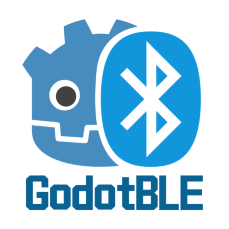

<div align="center">
  <h1>GDBLE - Godot Bluetooth Low Energy Plugin</h1>
<p>

</p>
<p>
    
    
    
    
  </p>
  <p><i>一个为 Godot 4 开发的现代化低功耗蓝牙（BLE）插件</i></p>
  <p>
    <a href="README.md">🇨🇳 中文</a> | 
    <a href="README_EN.md">🇺🇸 English</a>
  </p>
</div>
---

## 📖 目录

- [概述](#概述)
- [特性](#特性)
- [平台支持](#平台支持)
- [安装](#安装)
- [快速开始](#快速开始)
- [API 参考](#api-参考)
- [完整示例](#完整示例)
- [调试模式](#调试模式)
- [常见问题](#常见问题)
- [许可证](#许可证)

---

## 概述

GDBLE 是一个为 Godot 4 设计的蓝牙低功耗（BLE）插件，使用 Rust 和 GDExtension 构建。它基于 [btleplug](https://github.com/deviceplug/btleplug) 库，提供了完整的 BLE 功能，包括设备扫描、连接、服务发现、特征读写和通知订阅。

**插件地址**: [GDBLE - Godot Asset Library](https://godotengine.org/asset-library/asset/3439)

### 为什么选择 GDBLE？

- ✅ **现代化架构**: 使用 Rust 和异步运行时，性能优异
- ✅ **实时响应**: 非阻塞操作，不影响游戏帧率
- ✅ **完整功能**: 支持扫描、连接、读写、通知等所有 BLE 操作
- ✅ **易于使用**: 简洁的 GDScript API，信号驱动的事件系统
- ✅ **可调试**: 内置调试模式，方便开发和排错

---

## 特性

### 核心功能

- 🔍 **设备扫描**: 扫描附近的 BLE 设备，获取设备名称、地址和信号强度
- 🔗 **设备连接**: 连接到指定的 BLE 设备
- 🔎 **服务发现**: 自动发现设备的所有 GATT 服务和特征
- 📖 **特征读取**: 读取特征值
- ✍️ **特征写入**: 写入数据到特征（支持有响应和无响应模式）
- 🔔 **通知订阅**: 订阅特征通知，实时接收数据更新
- 🎯 **多设备管理**: 同时管理多个 BLE 设备连接

### 技术特性

- ⚡ **异步非阻塞**: 所有操作异步执行，不阻塞主线程
- 🔒 **线程安全**: 使用 Tokio 运行时，确保线程安全
- 📊 **信号驱动**: 通过 Godot 信号系统通知事件
- 🐛 **可调试**: 可选的调试模式，输出详细日志
- 🎮 **游戏友好**: 专为游戏开发优化，不影响帧率

---

## 平台支持

| 平台      | 状态  | 版本要求        |
| ------- | --- | ----------- |
| Windows | ✅   | Windows 10+ |
| macOS   | ✅   | macOS 10.15+ |
| Android | ✅   | Android 5.0+ (API 21+) |
| Linux   | 🚧  | 开发中         |

> 💡 **Android 用户**: 请查看 [Android 构建指南](ANDROID_BUILD.md) 了解详细的配置和使用说明。
> 
> ⚠️ **注意**: Android ARMv7 (32位) 架构暂不支持，请使用 ARM64 或 x86_64 架构。

---

## 安装

### 方法 1: 从 Asset Library 安装（推荐）

1. 在 Godot 编辑器中打开 **AssetLib**
2. 搜索 "GDBLE" 或 "Bluetooth"
3. 点击下载并安装

### 方法 2: 手动安装

1. 从 [Releases](https://github.com/Fantety/GodotBLE/releases) 下载最新版本
2. 解压到你的 Godot 项目的 `addons` 文件夹
3. 确保文件结构如下：

**桌面平台 (Windows/macOS)**:
```
your_project/
├── addons/
│   └── gdble/
│       ├── gdble.gdextension
│       └── gdble.dll (Windows) 或 libgdble.dylib (macOS)
```

**Android 平台**:
```
your_project/
├── addons/
│   └── gdble/
│       ├── gdble.gdextension
│       └── libgdble.so (ARM64 或 ARMv7)
├── res/
│   └── android/
│       ├── AndroidManifest.xml
│       └── gradle.properties
```

> ⚠️ **Android 注意事项**: 
> - 需要配置 AndroidManifest.xml 和 gradle.properties
> - 在导出时需要请求运行时权限
> - 详细说明请参考 [Android 构建指南](ANDROID_BUILD.md)

4. 重启 Godot 编辑器

---

## 快速开始

### 基本使用流程

```gdscript
extends Node

var bluetooth_manager: BluetoothManager

func _ready():
    # 1. 创建 BluetoothManager 实例
    bluetooth_manager = BluetoothManager.new()
    add_child(bluetooth_manager)
    
    # 2. 连接信号
    bluetooth_manager.adapter_initialized.connect(_on_adapter_initialized)
    bluetooth_manager.device_discovered.connect(_on_device_discovered)
    bluetooth_manager.scan_stopped.connect(_on_scan_stopped)
    
    # 3. Android 平台需要请求权限
    if OS.get_name() == "Android":
        _request_android_permissions()
    else:
        # 4. 初始化蓝牙适配器
        bluetooth_manager.initialize()

func _request_android_permissions():
    var permissions = [
        "android.permission.BLUETOOTH_SCAN",
        "android.permission.BLUETOOTH_CONNECT",
        "android.permission.ACCESS_FINE_LOCATION"
    ]
    
    for permission in permissions:
        if not OS.request_permission(permission):
            print("权限被拒绝: ", permission)
            return
    
    await get_tree().create_timer(1.0).timeout
    bluetooth_manager.initialize()

func _on_adapter_initialized(success: bool, error: String):
    if success:
        print("蓝牙初始化成功")
        # 开始扫描 10 秒
        bluetooth_manager.start_scan(10.0)
    else:
        print("蓝牙初始化失败: ", error)

func _on_device_discovered(device_info: Dictionary):
    print("发现设备: ", device_info.get("name", "Unknown"))
    print("  地址: ", device_info.get("address"))
    print("  信号强度: ", device_info.get("rssi"), " dBm")

func _on_scan_stopped():
    print("扫描完成")
    var devices = bluetooth_manager.get_discovered_devices()
    print("共发现 ", devices.size(), " 个设备")
```

### 连接设备并读写数据

```gdscript
var connected_device: BleDevice = null

func connect_to_device(address: String):
    # 连接设备
    connected_device = bluetooth_manager.connect_device(address)
    if connected_device:
        # 连接设备信号
        connected_device.connected.connect(_on_device_connected)
        connected_device.services_discovered.connect(_on_services_discovered)
        connected_device.characteristic_written.connect(_on_characteristic_written)
        
        # 开始连接
        connected_device.connect_async()


func _on_device_connected():
    print("设备已连接")
    # 发现服务
    connected_device.discover_services()

func _on_services_discovered(services: Array):
    print("发现 ", services.size(), " 个服务")
    
    # 遍历服务和特征
    for service in services:
        var service_uuid = service.get("uuid")
        var characteristics = service.get("characteristics", [])
        
        for characteristic in characteristics:
            var char_uuid = characteristic.get("uuid")
            var properties = characteristic.get("properties", {})
            
            # 如果特征支持写入，写入数据
            if properties.get("write", false):
                var data = "Hello BLE".to_utf8_buffer()
                connected_device.write_characteristic(service_uuid, char_uuid, data, false)

func _on_characteristic_written(char_uuid: String):
    print("数据写入成功: ", char_uuid)
```

---

## API 参考

### BluetoothManager

蓝牙管理器，负责适配器初始化、设备扫描和连接管理。

#### 方法

| 方法 | 参数 | 返回值 | 描述 |
|------|------|--------|------|
| `initialize()` | 无 | void | 初始化蓝牙适配器 |
| `is_initialized()` | 无 | bool | 检查适配器是否已初始化 |
| `start_scan(timeout_seconds)` | float | void | 开始扫描设备 |
| `stop_scan()` | 无 | void | 停止扫描 |
| `get_discovered_devices()` | 无 | Array[Dictionary] | 获取已发现的设备列表 |
| `connect_device(address)` | String | BleDevice | 连接到指定设备 |
| `disconnect_device(address)` | String | void | 断开指定设备 |
| `get_device(address)` | String | BleDevice | 获取已连接的设备实例 |
| `get_connected_devices()` | 无 | Array[BleDevice] | 获取所有已连接设备 |
| `set_debug_mode(enabled)` | bool | void | 启用/禁用调试模式 |
| `is_debug_mode()` | 无 | bool | 检查调试模式状态 |

#### 信号

| 信号 | 参数 | 描述 |
|------|------|------|
| `adapter_initialized` | success: bool, error: String | 适配器初始化完成 |
| `device_discovered` | device_info: Dictionary | 发现新设备 |
| `device_updated` | device_info: Dictionary | 设备信息更新 |
| `scan_started` | 无 | 扫描开始 |
| `scan_stopped` | 无 | 扫描停止 |
| `device_connecting` | address: String | 设备开始连接 |
| `device_connected` | address: String | 设备连接成功 |
| `device_disconnected` | address: String | 设备断开连接 |
| `error_occurred` | error_message: String | 发生错误 |


### BleDevice

表示单个 BLE 设备，提供连接、服务发现、数据读写等功能。

#### 方法

| 方法 | 参数 | 返回值 | 描述 |
|------|------|--------|------|
| `connect_async()` | 无 | void | 异步连接设备 |
| `disconnect()` | 无 | void | 断开设备连接 |
| `is_connected()` | 无 | bool | 检查是否已连接 |
| `get_address()` | 无 | String | 获取设备地址 |
| `get_name()` | 无 | String | 获取设备名称 |
| `discover_services()` | 无 | void | 发现设备服务 |
| `get_services()` | 无 | Array[Dictionary] | 获取已发现的服务列表 |
| `read_characteristic(service_uuid, char_uuid)` | String, String | void | 读取特征值 |
| `write_characteristic(service_uuid, char_uuid, data, with_response)` | String, String, PackedByteArray, bool | void | 写入特征值 |
| `subscribe_characteristic(service_uuid, char_uuid)` | String, String | void | 订阅特征通知 |
| `unsubscribe_characteristic(service_uuid, char_uuid)` | String, String | void | 取消订阅 |

#### 信号

| 信号 | 参数 | 描述 |
|------|------|------|
| `connected` | 无 | 设备连接成功 |
| `disconnected` | 无 | 设备断开连接 |
| `connection_failed` | error: String | 连接失败 |
| `services_discovered` | services: Array | 服务发现完成 |
| `characteristic_read` | char_uuid: String, data: PackedByteArray | 特征读取完成 |
| `characteristic_written` | char_uuid: String | 特征写入完成 |
| `characteristic_notified` | char_uuid: String, data: PackedByteArray | 收到特征通知 |
| `operation_failed` | operation: String, error: String | 操作失败 |

---

## 完整示例

### 示例 1: 扫描并连接设备

```gdscript
extends Node

var bluetooth_manager: BluetoothManager
var target_device_name = "MyDevice"

func _ready():
    bluetooth_manager = BluetoothManager.new()
    add_child(bluetooth_manager)
    
    bluetooth_manager.adapter_initialized.connect(_on_initialized)
    bluetooth_manager.device_discovered.connect(_on_device_found)
    bluetooth_manager.scan_stopped.connect(_on_scan_done)
    
    bluetooth_manager.initialize()

func _on_initialized(success: bool, error: String):
    if success:
        bluetooth_manager.start_scan(10.0)

func _on_device_found(info: Dictionary):
    var name = info.get("name", "")
    if name == target_device_name:
        print("找到目标设备!")
        bluetooth_manager.stop_scan()
        connect_to_target(info.get("address"))


func _on_scan_done():
    print("扫描完成")

func connect_to_target(address: String):
    var device = bluetooth_manager.connect_device(address)
    if device:
        device.connected.connect(_on_connected)
        device.connect_async()

func _on_connected():
    print("设备已连接!")
```

### 示例 2: 读取传感器数据

```gdscript
extends Node

var bluetooth_manager: BluetoothManager
var sensor_device: BleDevice

# 标准心率服务 UUID
const HEART_RATE_SERVICE = "0000180d-0000-1000-8000-00805f9b34fb"
const HEART_RATE_MEASUREMENT = "00002a37-0000-1000-8000-00805f9b34fb"

func _ready():
    bluetooth_manager = BluetoothManager.new()
    add_child(bluetooth_manager)
    
    bluetooth_manager.adapter_initialized.connect(_on_initialized)
    bluetooth_manager.device_discovered.connect(_on_device_found)
    
    bluetooth_manager.initialize()

func _on_initialized(success: bool, error: String):
    if success:
        bluetooth_manager.start_scan(10.0)

func _on_device_found(info: Dictionary):
    # 查找心率监测器
    var name = info.get("name", "")
    if "Heart" in name or "HR" in name:
        bluetooth_manager.stop_scan()
        connect_to_sensor(info.get("address"))

func connect_to_sensor(address: String):
    sensor_device = bluetooth_manager.connect_device(address)
    if sensor_device:
        sensor_device.connected.connect(_on_sensor_connected)
        sensor_device.services_discovered.connect(_on_services_found)
        sensor_device.characteristic_notified.connect(_on_heart_rate_update)
        sensor_device.connect_async()

func _on_sensor_connected():
    print("传感器已连接")
    sensor_device.discover_services()

func _on_services_found(services: Array):
    # 订阅心率通知
    sensor_device.subscribe_characteristic(HEART_RATE_SERVICE, HEART_RATE_MEASUREMENT)

func _on_heart_rate_update(char_uuid: String, data: PackedByteArray):
    if char_uuid.to_lower() == HEART_RATE_MEASUREMENT:
        # 解析心率数据（简化版）
        if data.size() > 1:
            var heart_rate = data[1]
            print("当前心率: ", heart_rate, " BPM")
```


### 示例 3: 控制智能灯泡

```gdscript
extends Node

var bluetooth_manager: BluetoothManager
var light_device: BleDevice

# 自定义服务 UUID（示例）
const LIGHT_SERVICE = "0000fff0-0000-1000-8000-00805f9b34fb"
const LIGHT_CONTROL = "0000fff2-0000-1000-8000-00805f9b34fb"

func _ready():
    bluetooth_manager = BluetoothManager.new()
    add_child(bluetooth_manager)
    
    bluetooth_manager.adapter_initialized.connect(_on_initialized)
    bluetooth_manager.initialize()

func _on_initialized(success: bool, error: String):
    if success:
        bluetooth_manager.start_scan(10.0)

func connect_to_light(address: String):
    light_device = bluetooth_manager.connect_device(address)
    if light_device:
        light_device.connected.connect(_on_light_connected)
        light_device.services_discovered.connect(_on_services_found)
        light_device.characteristic_written.connect(_on_command_sent)
        light_device.connect_async()

func _on_light_connected():
    print("灯泡已连接")
    light_device.discover_services()

func _on_services_found(services: Array):
    print("服务发现完成，可以控制灯泡了")

func set_light_color(red: int, green: int, blue: int):
    # 构造颜色命令（示例格式）
    var command = PackedByteArray([0x01, red, green, blue])
    light_device.write_characteristic(LIGHT_SERVICE, LIGHT_CONTROL, command, false)

func turn_on():
    var command = PackedByteArray([0x02, 0x01])
    light_device.write_characteristic(LIGHT_SERVICE, LIGHT_CONTROL, command, false)

func turn_off():
    var command = PackedByteArray([0x02, 0x00])
    light_device.write_characteristic(LIGHT_SERVICE, LIGHT_CONTROL, command, false)

func _on_command_sent(char_uuid: String):
    print("命令已发送")

# 在 UI 中调用
func _on_red_button_pressed():
    set_light_color(255, 0, 0)

func _on_green_button_pressed():
    set_light_color(0, 255, 0)

func _on_blue_button_pressed():
    set_light_color(0, 0, 255)
```

---

## 调试模式

GDBLE 提供了可选的调试模式，帮助你排查问题。

### 启用调试模式

```gdscript
# 启用调试模式 - 显示详细日志
bluetooth_manager.set_debug_mode(true)
```


### 调试输出示例

启用调试模式后，你会看到详细的内部日志：

```
[BLE Info] Starting Bluetooth adapter initialization
[BLE Debug] Checking initialization state
[BLE Debug] Creating Tokio runtime manager
[BLE Debug] Acquiring Bluetooth adapter
[BLE Info] Bluetooth adapter acquired successfully
[BLE Info] Starting BLE device scan for 10 seconds
[BLE Debug] Spawning scan task asynchronously
[BLE Info] Discovered device: MyDevice (XX:XX:XX:XX:XX:XX), RSSI: -45
```

### 禁用调试模式

```gdscript
# 禁用调试模式（默认）- 保持输出清洁
bluetooth_manager.set_debug_mode(false)
```

### 条件调试

```gdscript
# 只在调试构建中启用
bluetooth_manager.set_debug_mode(OS.is_debug_build())
```

---

## 常见问题

### Q: 为什么扫描不到设备？

**A:** 请检查：
1. 确保蓝牙适配器已启用
2. 确保目标设备处于广播状态
3. 检查设备是否在范围内（通常 10 米以内）
4. 启用调试模式查看详细日志

### Q: 连接设备失败怎么办？

**A:** 可能的原因：
1. 设备已被其他应用连接
2. 设备超出范围
3. 设备电量不足
4. 需要配对但未配对

### Q: 如何处理设备断开？

**A:** 监听 `disconnected` 信号：

```gdscript
device.disconnected.connect(_on_device_disconnected)

func _on_device_disconnected():
    print("设备断开，尝试重连...")
    # 实现重连逻辑
```

### Q: 写入数据没有响应？

**A:** 检查：
1. 特征是否支持写入（查看 `properties.write`）
2. 数据格式是否正确
3. 是否需要使用 `with_response` 参数
4. 启用调试模式查看错误信息

### Q: 如何找到正确的服务和特征 UUID？

**A:** 
1. 查看设备文档或规格说明
2. 使用调试模式查看所有服务
3. 使用标准 BLE 服务（如心率、电池等）
4. 使用第三方 BLE 扫描工具（如 nRF Connect）

### Q: 支持同时连接多个设备吗？

**A:** 是的，GDBLE 支持同时管理多个设备连接：

```gdscript
var device1 = bluetooth_manager.connect_device(address1)
var device2 = bluetooth_manager.connect_device(address2)
```


### Q: 性能如何？会影响游戏帧率吗？

**A:** GDBLE 使用异步架构，所有蓝牙操作在后台线程执行，不会阻塞主线程或影响游戏帧率。

---

## 数据格式说明

### DeviceInfo Dictionary

设备信息字典包含以下字段：

```gdscript
{
    "name": String,      # 设备名称（可能为空）
    "address": String,   # 设备地址（UUID 或 MAC）
    "rssi": int         # 信号强度（dBm）
}
```

### Service Dictionary

服务字典包含以下字段：

```gdscript
{
    "uuid": String,                    # 服务 UUID
    "characteristics": Array[Dictionary]  # 特征列表
}
```

### Characteristic Dictionary

特征字典包含以下字段：

```gdscript
{
    "uuid": String,        # 特征 UUID
    "properties": {        # 特征属性
        "read": bool,                    # 是否可读
        "write": bool,                   # 是否可写（需响应）
        "write_without_response": bool,  # 是否可写（无响应）
        "notify": bool,                  # 是否支持通知
        "indicate": bool                 # 是否支持指示
    }
}
```

---

## 最佳实践

### 1. 错误处理

始终处理错误情况：

```gdscript
bluetooth_manager.adapter_initialized.connect(func(success, error):
    if not success:
        push_error("蓝牙初始化失败: " + error)
        # 显示错误提示给用户
)

device.connection_failed.connect(func(error):
    push_error("连接失败: " + error)
    # 尝试重连或提示用户
)
```

### 2. 资源清理

在节点销毁时清理资源：

```gdscript
func _exit_tree():
    if device and device.is_connected():
        device.disconnect()
    if bluetooth_manager:
        bluetooth_manager.stop_scan()
```

### 3. 超时处理

为长时间操作设置超时：

```gdscript
var connection_timeout = 10.0
var timeout_timer: Timer

func connect_with_timeout(address: String):
    timeout_timer = Timer.new()
    add_child(timeout_timer)
    timeout_timer.timeout.connect(_on_connection_timeout)
    timeout_timer.start(connection_timeout)
    
    device = bluetooth_manager.connect_device(address)
    device.connected.connect(_on_connected)
    device.connect_async()

func _on_connected():
    timeout_timer.stop()
    print("连接成功")

func _on_connection_timeout():
    print("连接超时")
    if device:
        device.disconnect()
```


### 4. 状态管理

维护清晰的连接状态：

```gdscript
enum DeviceState {
    DISCONNECTED,
    CONNECTING,
    CONNECTED,
    DISCOVERING_SERVICES,
    READY
}

var device_state = DeviceState.DISCONNECTED

func connect_device(address: String):
    device_state = DeviceState.CONNECTING
    device = bluetooth_manager.connect_device(address)
    # ...

func _on_connected():
    device_state = DeviceState.CONNECTED
    device.discover_services()
    device_state = DeviceState.DISCOVERING_SERVICES

func _on_services_discovered(services: Array):
    device_state = DeviceState.READY
    # 现在可以进行读写操作
```

### 5. 数据验证

验证接收到的数据：

```gdscript
func _on_characteristic_read(char_uuid: String, data: PackedByteArray):
    if data.size() == 0:
        push_warning("收到空数据")
        return
    
    if data.size() < expected_size:
        push_warning("数据长度不足")
        return
    
    # 处理数据
    process_data(data)
```

---


## 性能优化建议

### 1. 扫描优化

```gdscript
# 使用合适的扫描时间
bluetooth_manager.start_scan(5.0)  # 5秒通常足够

# 找到目标设备后立即停止扫描
func _on_device_discovered(info: Dictionary):
    if info.get("name") == target_name:
        bluetooth_manager.stop_scan()
```

### 2. 写入优化

```gdscript
# 对于不需要确认的数据，使用无响应写入
device.write_characteristic(service, char, data, false)  # 更快

# 对于重要数据，使用有响应写入
device.write_characteristic(service, char, data, true)   # 更可靠
```

### 3. 通知优化

```gdscript
# 只订阅需要的特征
device.subscribe_characteristic(service, char)

# 不再需要时取消订阅
device.unsubscribe_characteristic(service, char)
```

---

## 故障排除

### 启用详细日志

```gdscript
bluetooth_manager.set_debug_mode(true)
```

### 检查适配器状态

```gdscript
if not bluetooth_manager.is_initialized():
    print("适配器未初始化")
```

### 验证设备连接

```gdscript
if device and device.is_connected():
    print("设备已连接")
else:
    print("设备未连接")
```

### 查看发现的服务

```gdscript
func _on_services_discovered(services: Array):
    print("发现的服务:")
    for service in services:
        print("  服务: ", service.get("uuid"))
        for char in service.get("characteristics", []):
            print("    特征: ", char.get("uuid"))
            print("    属性: ", char.get("properties"))
```

---

## 贡献

欢迎贡献代码、报告问题或提出建议！

- 报告问题: [GitHub Issues](https://github.com/Fantety/GodotBLE/issues)
- 提交代码: [Pull Requests](https://github.com/Fantety/GodotBLE/pulls)

---

## 许可证

本项目采用 MIT 许可证。详见 [LICENSE](LICENSE) 文件。

---

## 致谢

- [btleplug](https://github.com/deviceplug/btleplug) - 优秀的 Rust BLE 库
- [godot-rust](https://github.com/godot-rust/gdext) - Godot Rust 绑定
- Godot 社区的支持和反馈

---

## 联系方式

- GitHub: [@Fantety](https://github.com/Fantety)
- 项目主页: [GodotBLE](https://github.com/Fantety/GodotBLE)

---

<div align="center">
  <p>如果这个项目对你有帮助，请给个 ⭐️ Star！</p>
  <p>Made with ❤️ for Godot Community</p>
</div>
